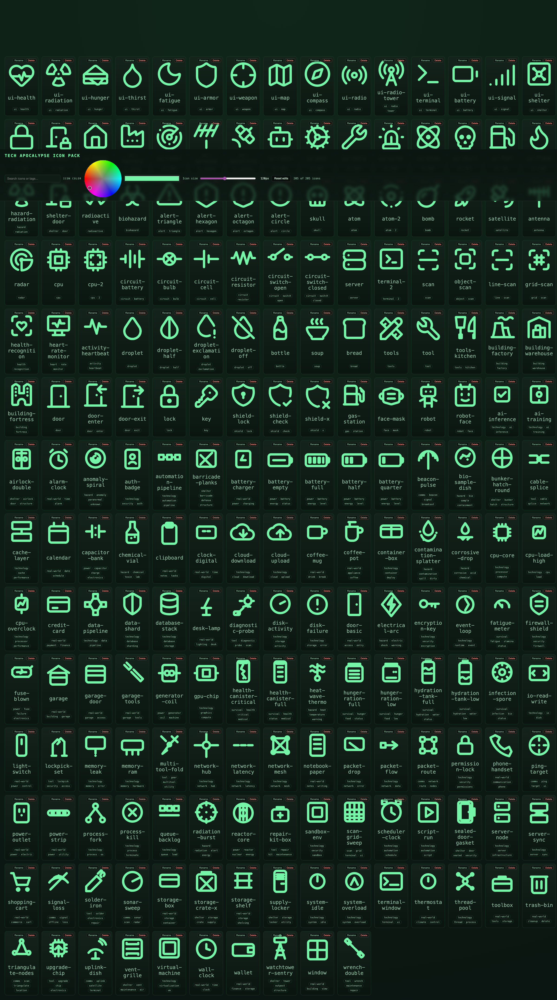

# Tech Apocalypse Icons

Retro-futurist terminal UI icon pack. Includes SVGs, React components, and a searchable preview.

## Live preview

https://omiron33.github.io/tech-apocalypse-icons/

## Contact sheet



## Install

```bash
npm install tech-apocalypse-icons
# or
pnpm add tech-apocalypse-icons
# or
yarn add tech-apocalypse-icons
```

## React usage

```tsx
import { UiHealth, HazardRadiation, ShelterDoor } from "tech-apocalypse-icons";

export function Status() {
  return (
    <div style={{ display: "flex", gap: 8, color: "#74f5a7" }}>
      <UiHealth width={20} height={20} />
      <HazardRadiation width={20} height={20} />
      <ShelterDoor width={20} height={20} />
    </div>
  );
}
```

Icons use `currentColor` so they inherit CSS color by default.

## SVG usage

```ts
import iconUrl from "tech-apocalypse-icons/svgs/ui-health.svg";
```

(Use with bundlers that support importing SVG assets.)

## Manifest

```ts
import manifest from "tech-apocalypse-icons/manifest.json";
```

Each entry includes `icon_name`, `tags`, `source_url`, and license metadata.

## License

- This package: MIT (see `LICENSE`)
- Third-party sources: Lucide (ISC) and Tabler (MIT) — see `THIRD_PARTY_NOTICES.md`

## Disclaimer

Not affiliated with or endorsed by any game studio, publisher, or trademark holder.
